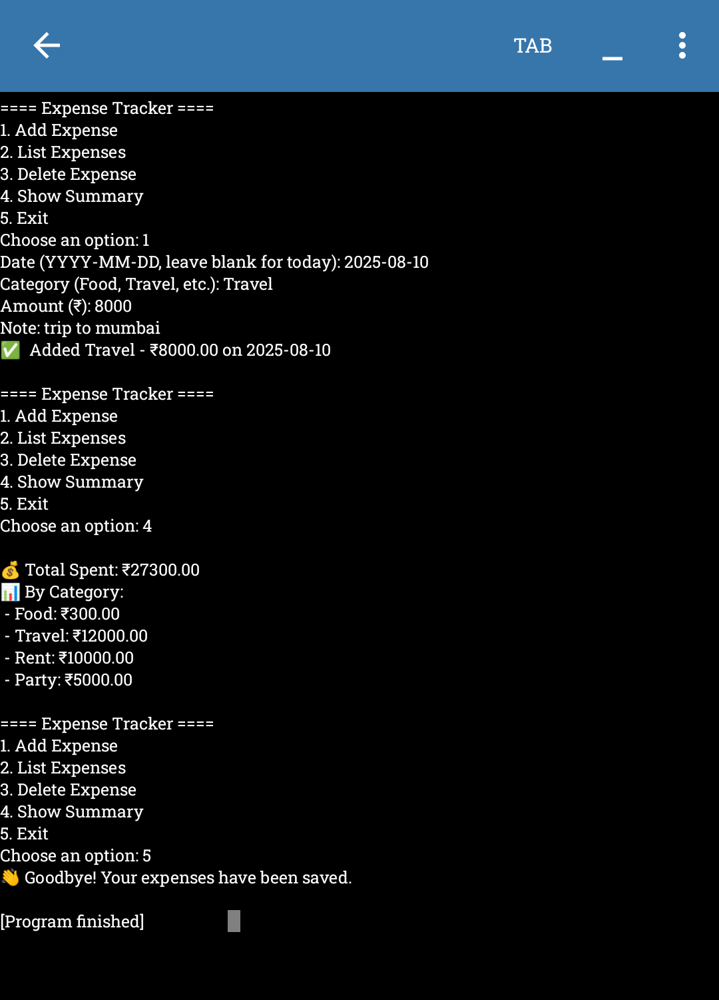

# PERSONAL EXPENSE TRACKER 💰 💰 


A simple expense tracker with CSV storage.

## ✨ Features
- Add, list, and delete expenses
- Automatically saves data in `expenses.csv`
- Handles wrong inputs 
- Works offline — just needs Python 3

## 🚀 Usage
```bash
python expense_tracker.py

## 🌟 GLIMPSE

